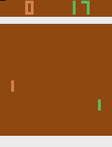

# DQN
Implements a Double Dueling Deep Q-Network (DQN) in PyTorch.

The following agent was trained on the pixel input of the [Atari 2600 Pong](https://gym.openai.com/envs/Pong-v0/)  environment from OpenAI gym:  

